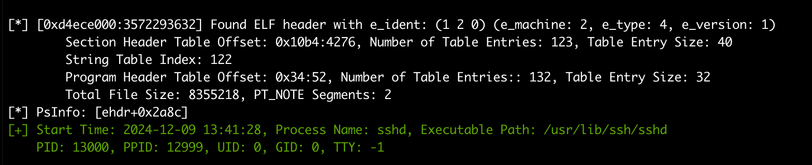
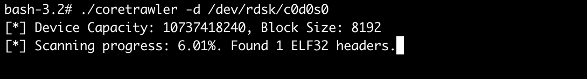

# CoreTrawler


**Coretrawler** is a data forensics utility for Solaris designed to scan raw disk devices on a live host for core dump files. It can parse core files to extract valuable information such as the generating process name, executable path, process id, parent process id, process start timestamp, and optionally extract and save full core files to a specified directory.

## Why Coretrawler?

Attackers frequently attempt to cover their tracks by deleting crucial evidence like core dump files. These files are important as they can capture critical details about a compromised process, such as in-memory exploit payloads, memory state at the time of a crash, and other indicators of malicious activity.

Consider a reliable exploit for a vulnerability like **CVE-2020-14871** (remote code execution on Sun Solaris SSHd). When the exploit attempts to achieve stable code execution it may send multiple requests which can inadvertently crash the targeted sshd process and generate multiple core files. A sophisticated attacker would likely remove these core files to erase traces of their entry method. Coretrawler provides a capability to recover these files by scanning the raw disk directly, offering insights into the attack vector, compromised process, and post-exploitation activity. 

## Features

*   **Raw Disk Scanning:** Scans specified raw disk devices (slices) on a live Solaris host.

*   **Core File Parsing:** Attempts to parse identified core files to retrieve:
    *   ELF Header details
    *   Name of the process that generated the core.
    *   Executable path
    *   Process Id, Parent Process Id, UID, GID, TTY
    *   Start time of process.
*   **Targeted Search:**
    *   Filter core file searches by process name.
    *   Specify custom start and end offsets for disk scanning.
*   **Extraction:** Option to extract discovered core files from the raw disk and write them to a user-defined directory.


## Credit

**CoreTrawler** owes its conceptual origins to a colleague's clever shell script. This script effectively uses `dd` and `readelf` to pull core files from the raw device.

## Prerequisites

*   Solaris Operating System.
*   A C compiler (e.g., GCC or Oracle Solaris Studio C compiler).
*   Root privileges are required to read raw disk devices.

## Compilation

To compile `coretrawler`:

```bash
make
```
## Usage

`coretrawler` requires root privileges to access raw disk devices.

```
coretrawler --disk_path <path> [--filter_name <name>] [--offset <start_offset>] [--e_offset <end_offset>] [--debug] [--core_path <path>] [--write-file]
```


### Options:

*   `-d, --disk_path=<path>`: **(required)** Path to the raw disk device (e.g., `/dev/rdsk/c0t0d0s0`).
*   `-f, --filter_name=<name>`: Filter results to only show core files generated by processes with this name (e.g., `my_app`). Default is to search for all process core files.
*   `-o, --offset=<offset>`: Specify the starting offset (in bytes) on the raw disk to begin scanning.
*   `-e, --e_offset=<offset>`: Specify the end offset (in bytes) on the raw disk to stop scanning.
*   `-c, --core_path=<path>`: Directory where extracted core files will be written if `--write_file` is used.
    *   Default: `./exhumedcores`
    *   **Important:** It is highly recommended to choose a path on a different filesystem/partition than the one specified by `--disk_path` to avoid overwriting data or interfering with the scan.
*   `-w, --write_file`: If specified, discovered core files will be extracted and written to the directory specified by `--core_path`.
    *   Default: Scans and reports only; does not write files.
*   `-v, --debug`: Enable verbose debug output for detailed logging.
    *   Default: Debug output is disabled.


## Considerations

*   **Root Privileges:** Accessing raw disk devices (e.g., `/dev/rdsk/*`) almost universally requires root privileges.
*   **Performance:** Scanning large disk devices can be very time-consuming. Using `--offset` and `--e_offset` can help narrow down the search if you have an idea of where a core file might reside.
*   **Accuracy:** The accuracy of core file identification and parsing depends on the integrity of the core file data on the disk. Severely corrupted or fragmented core files might not be fully identified or parsed correctly.
*   **Data Safety:**
    *   This tool reads from raw disks. While designed to be non-destructive in its read operations, any tool operating at this level carries inherent risks if misused.
    *   **Crucially:** When using `--write_file` and `--core_path`, **ALWAYS** ensure the output directory is on a *different* filesystem/partition than the disk being scanned. Writing to the same disk could overwrite the very data you are trying to recover or cause other filesystem corruption.
*   **Solaris Disk Naming:** Be sure to use the correct raw device path for the Solaris slice you intend to scan (e.g., `/dev/rdsk/c0t1d0s2`).
